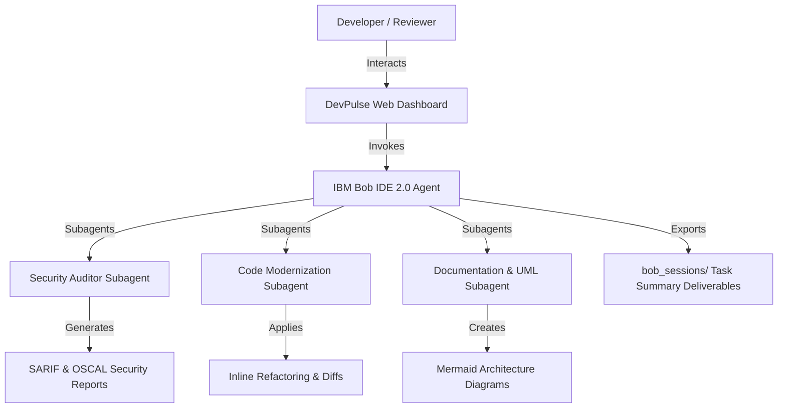

# AGENTS.md — IBM Bob 2.0 Project Context & Architectural Guide

## Project Overview
**DevPulse** is a smart developer onboarding, automated code review, and DevSecOps quality workspace built with **IBM Bob 2.0**.
It addresses the critical developer friction points:
1. Long onboarding times for unfamiliar codebases.
2. Manual code reviews and security audit overhead.
3. Inconsistent git commit messages and PR descriptions.

## Technology Stack & Architecture
- **Frontend**: Vite Vanilla JS / HTML5 / CSS3 (Carbon Design System Dark Theme)
- **Diagram Engine**: Mermaid.js (Class, Sequence, and Flowchart diagrams)
- **AI Core**: IBM Bob IDE 2.0 (Agent Mode, Literate Coding, Custom Security Skills, Subagents)
- **Optional Integrations**: IBM watsonx Orchestrate & IBM watsonx.ai (Granite foundation models)

## System Architecture Diagram

## Team Rules & Persona Configurations
- **Mode**: Agent Mode (`agent`)
- **Coding Style**: Strict ES6+ Modular Vanilla JS, Carbon Design HSL color palette, no external framework bloat.
- **Security Baseline**: Scans against OWASP ASVS v4.0 standards.
- **Git Commit Standard**: Conventional Commits (`feat:`, `fix:`, `docs:`, `refactor:`, `test:`).
