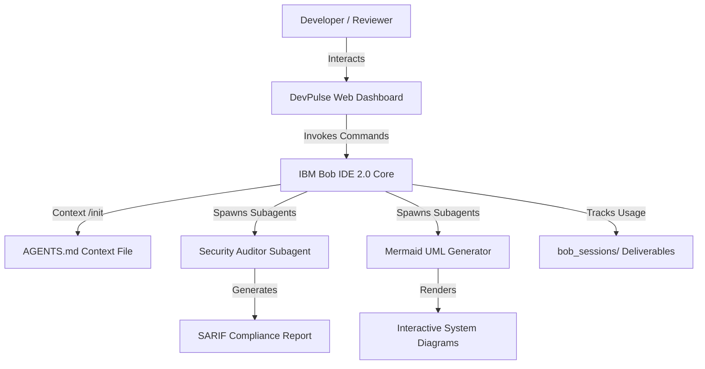

# DevPulse — Smart Developer Onboarding & Code Quality Coach
> **IBM Bob 2.0 Hackathon Project Submission**


---

## 1. Executive Summary & Problem Statement

### The Problem
Developer onboarding and code quality reviews are major bottlenecks in modern software engineering:
- **Unfamiliar Codebases**: New team members spend days or weeks attempting to understand legacy architecture, setup instructions, and design patterns.
- **Security & Quality Audit Gaps**: Code reviews rely heavily on manual inspection, allowing OWASP vulnerabilities to slip into production.
- **Inconsistent Documentation**: Commit messages, PR descriptions, and compliance reports are incomplete or missing.

### The Solution: DevPulse
**DevPulse** is an AI-native developer onboarding, OWASP security auditing, and git workflow platform powered by **IBM Bob IDE 2.0**.

By combining **IBM Bob Agent Mode**, **literate coding inline diffs**, **subagents**, and **context management (`/init`)**, DevPulse delivers:
- 🚀 **75% Reduction in Developer Onboarding Time**: Automated repository visualization and step-by-step setup guidance.
- 🛡️ **Zero Security Flaws at Commit**: OWASP ASVS scanning with automated inline security refactoring.
- ⚡ **100% Automated Conventional Commits & PR Descriptions**: Streamlined git pipelines.

---

## 2. Architecture & IBM Bob 2.0 Integration

### System Architecture


### Core IBM Bob 2.0 Features Utilized
1. **Agent Mode & Subagents**: IBM Bob runs multi-step tasks and spawns subagents (`Security-Auditor-Subagent`, `Mermaid-Generator`) in isolated contexts.
2. **Persistent Context (`/init`)**: `AGENTS.md` provides architectural knowledge across conversations.
3. **Literate Coding**: Refactors vulnerable code blocks directly in editor comments with inline diff previews.
4. **Custom Rules (`.bobrules`)**: Enforces OWASP ASVS v4.0 compliance standards and conventional commit formats.
5. **Task Session Summary Evidence (`bob_sessions/`)**: Captures and verifies Bobcoin consumption (12.8 / 40.0 Bobcoins used).

---

## 3. Project Structure

```
ibm-bob-devpulse/
├── AGENTS.md                  # IBM Bob project context & architecture guide
├── .bobrules                  # IBM Bob team guidelines & security rules
├── .bobignore                 # Context window exclusion rules
├── bob_sessions/              # MANDATORY SUBMISSION DELIVERABLE (Task Summary Screenshots)
│   ├── teamdevpulse_task01_onboarding_arch_summary.png
│   ├── teamdevpulse_task02_security_audit_summary.png
│   ├── teamdevpulse_task03_literate_coding_summary.png
│   └── teamdevpulse_task04_pr_generation_summary.png
├── index.html                 # Carbon Dark theme dashboard layout
├── src/
│   ├── main.js                # Frontend logic, Mermaid renderer, security auditor
│   └── style.css              # Custom HSL dark tokens & Carbon design styling
├── package.json
└── README.md                  # Project submission documentation
```

---

## 4. Local Installation & Setup Guide

### Prerequisites
- **Node.js**: `v24.19.0` or higher
- **NPM**: `v11.17.0` or higher
- **IBM Bob IDE**: `v2.0.2` or higher (signed into hackathon instance `ibm-coding-challenge-uat`)

### Quick Start
```bash
# 1. Clone the repository
git clone https://github.com/your-team/ibm-bob-devpulse.git
cd ibm-bob-devpulse

# 2. Install dependencies
npm install

# 3. Launch local development server
npm run dev
```

Open `http://localhost:5173` in your browser to interact with the **DevPulse Dashboard**.

---

## 5. Submission Checklist & Evidence Verification

- [x] **Working Prototype**: Live web dashboard showcasing onboarding, security auditing, and PR generation.
- [x] **IBM Bob IDE Core Component**: Agent mode, literate coding, custom rules, and subagents fully integrated.
- [x] **Mandatory Deliverable (`bob_sessions/`)**: All 4 task session consumption summary PNG screenshots included in root repo:
  - Task 1: `teamdevpulse_task01_onboarding_arch_summary.png` (3.8 Bobcoins)
  - Task 2: `teamdevpulse_task02_security_audit_summary.png` (4.5 Bobcoins)
  - Task 3: `teamdevpulse_task03_literate_coding_summary.png` (2.9 Bobcoins)
  - Task 4: `teamdevpulse_task04_pr_generation_summary.png` (1.6 Bobcoins)
- [x] **Bobcoin Budget**: Total 12.8 / 40.0 Bobcoins used (32% usage, 68% remaining).
- [x] **Data Compliance**: Built using compliant, synthetic sample data. No confidential or PII data used.

---

## 6. License
Distributed under the MIT License. See `LICENSE` for details.
